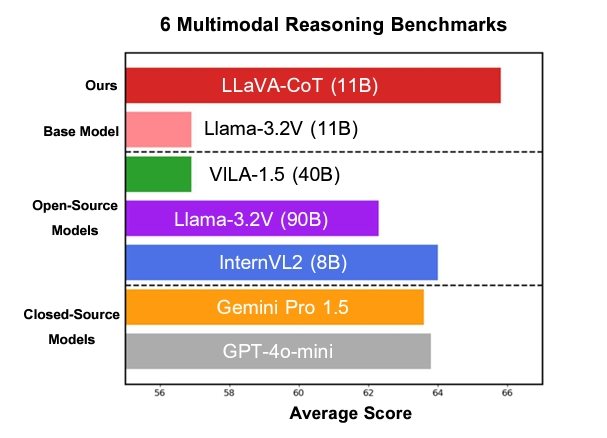
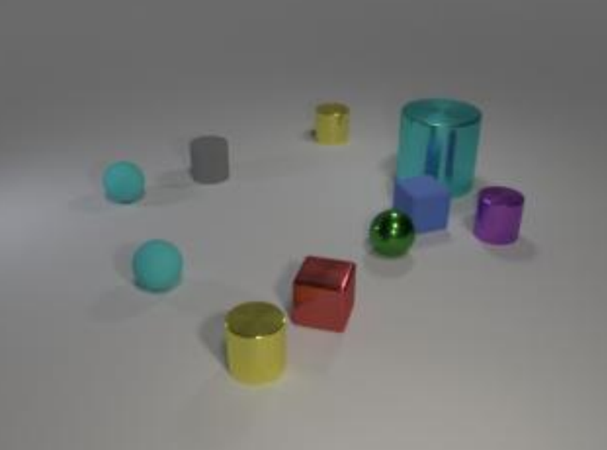
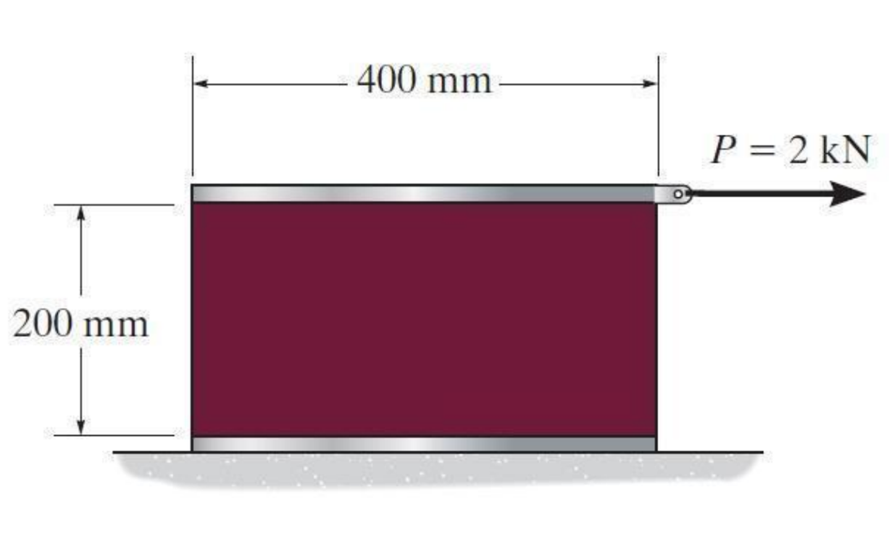

<div align=center>

</div>

<h2 align="center"> <a href="https://arxiv.org/abs/2411.10440v2">LLaVA-CoT: Let Vision Language Models Reason Step-by-Step</a></h2>

<h5 align="center"><p>This project was previously named LLaVA-o1. We have renamed it to LLaVA-CoT. </h5>
<h5 align="center"> If you like our project, please give us a star ⭐ on GitHub for the latest update.</h5>

<h5 align=center>

[](https://huggingface.co/spaces/Xkev/Llama-3.2V-11B-cot)
[](https://huggingface.co/Xkev/Llama-3.2V-11B-cot)
[](https://arxiv.org/abs/2411.10440v2)
[](https://x.com/Kevin_GuoweiXu/status/1858338565463421244)
[](https://github.com/PKU-YuanGroup/LLaVA-CoT/blob/main/LICENSE)
[](https://hits.seeyoufarm.com/api/count/incr/badge.svg?url=https%3A%2F%2Fgithub.com%2FPKU-YuanGroup%2FLLaVA-CoT&count_bg=%2379C83D&title_bg=%23555555&icon=&icon_color=%23E7E7E7&title=hits&edge_flat=false)
[](https://replicate.com/chenxwh/llava-cot)
[](https://wisemodel.cn/codes/KevinTHU/LLaVA-CoT)

</h5>

<h5 align="center">本项目希望构建开源慢思考大模型，由北大-兔展AIGC联合实验室共同发起。</h5>

## 📣 News

- **[2025/04/13]** We have updated the inference script that does not rely on VLMEvalKit, based on the suggestion in [this issue](https://github.com/PKU-YuanGroup/LLaVA-CoT/issues/34).
- **[2025/01/08]** We released the full training code.
- **[2025/01/02]** We discovered that when testing with the AI2D benchmark, we were using AI2D_TEST_NO_MASK, while the VLMEvalKit utilizes AI2D_TEST. We previously overlooked the distinction between the two, and we sincerely apologize for this oversight. We will make the necessary corrections.
- **[2024/11/28]** We've released the dataset: [https://huggingface.co/datasets/Xkev/LLaVA-CoT-100k](<[dataset_generation/generate.py](https://huggingface.co/datasets/Xkev/LLaVA-CoT-100k)>)
- **[2024/11/25]** We've released the code for dataset generation: [dataset_generation/generate.py](dataset_generation/generate.py)
- **[2024/11/23]** We've released the Gradio App: [https://huggingface.co/spaces/Xkev/Llama-3.2V-11B-cot](https://huggingface.co/spaces/Xkev/Llama-3.2V-11B-cot)
- **[2024/11/21]** LLaVA-o1 is renamed to LLaVA-CoT [https://arxiv.org/abs/2411.10440v2](https://arxiv.org/abs/2411.10440v2).
- **[2024/11/20]** We've released the pretrained weights: [https://huggingface.co/Xkev/Llama-3.2V-11B-cot](https://huggingface.co/Xkev/Llama-3.2V-11B-cot)
- **[2024/11/18]** We've released our paper: [https://arxiv.org/abs/2411.10440](https://arxiv.org/abs/2411.10440)
- **[2024/11/18]** Welcome to **watch** 👀 this repository for the latest updates.

## 🔥 Highlights

**LLaVA-CoT** is a visual language model capable of spontaneous, systematic reasoning.

Our 11B model outperforms **Gemini-1.5-pro**,**GPT-4o-mini**, and **Llama-3.2-90B-Vision-Instruct** on six challenging multimodal benchmarks.

<div align=center>

</div>

## 🚀 Demos

LLaVA-CoT begins by outlining the problem, interprets relevant information from the image, proceeds step-by-step through reasoning, and ultimately reaches a well-supported conclusion.

### Reasoning Problems

| **Question**                      |  <br> Subtract all tiny shiny balls. Subtract all purple objects. How many objects are left? Options: A. 4, B. 8, C. 2, D. 6                                                                                                                                                                                                                                                                                                                                                                                                                                                                                                                                                                                                                                                                                                                                                                                                                                                                                                                                                                                                                                                                                                                                                                                                                                                                                                                                                                                                                                                                                                                                                                                                           |
| --------------------------------- | ----------------------------------------------------------------------------------------------------------------------------------------------------------------------------------------------------------------------------------------------------------------------------------------------------------------------------------------------------------------------------------------------------------------------------------------------------------------------------------------------------------------------------------------------------------------------------------------------------------------------------------------------------------------------------------------------------------------------------------------------------------------------------------------------------------------------------------------------------------------------------------------------------------------------------------------------------------------------------------------------------------------------------------------------------------------------------------------------------------------------------------------------------------------------------------------------------------------------------------------------------------------------------------------------------------------------------------------------------------------------------------------------------------------------------------------------------------------------------------------------------------------------------------------------------------------------------------------------------------------------------------------------------------------------------------------------------------------------------------------------------------------------------------- |
| **Llama-3.2-11B-Vision-Instruct** | To determine the correct answer, we need to follow the instructions provided. <br> The first instruction is to subtract all tiny shiny balls. <br> Since there are <span style="color: red;">three tiny shiny balls</span> in the image, we would be left with no shiny balls after performing this action. <br> The second instruction is to subtract all purple objects. However, upon closer inspection, it becomes apparent that there are <span style="color: red;">no shiny purple objects</span> present in the image. Therefore, we cannot subtract any purple objects. <br> Given that we have already removed all the tiny shiny balls and there were no purple objects to begin with, the correct answer is <span style="color: red;">C. 2</span>, as initially, there were 2 purple objects, but they are not to be subtracted according to the instruction.                                                                                                                                                                                                                                                                                                                                                                                                                                                                                                                                                                                                                                                                                                                                                                                                                                                                                                            |
| **LLaVA-CoT**                     | **_Summary stage: What's the problem? What should I do?_** <br> <span style="color: gray;">&lt;SUMMARY&gt;</span> I will examine the image to identify and count all the objects, focusing on the <span style="color: green;">tiny shiny balls and purple objects</span>. Then, I will subtract these objects from the total count and determine the number of remaining objects. <span style="color: gray;">&lt;/SUMMARY&gt;</span> <br>**_Caption stage: What can I know from the image?_** <br> <span style="color: gray;">&lt;CAPTION&gt;</span> The image shows various 3D geometric shapes on a flat surface, including spheres, cubes, and cylinders in different colors. Notably, there are <span style="color: green;">small shiny green spheres</span> and <span style="color: green;">a purple cylinder</span>. <span style="color: gray;">&lt;/CAPTION&gt;</span> <br> **_Reasoning stage: How to solve the problem step-by-step?_** <br> <span style="color: gray;">&lt;REASONING&gt;</span> First, I will count all the objects in the image: there are <span style="color: green;">10 objects in total</span>. Next, I will identify and subtract the tiny shiny balls. There is <span style="color: green;">one small shiny green sphere</span>. Then, I will identify and subtract the purple objects. There is <span style="color: green;">one purple cylinder</span>. By subtracting the two objects (the shiny ball and the purple cylinder) from the total, I find that <span style="color: green;">8 objects remain</span>. <span style="color: gray;">&lt;/REASONING&gt;</span> <br> **_Conclusion stage: What is the final answer?_** <br> <span style="color: gray;">&lt;CONCLUSION&gt;</span> **B** <span style="color: gray;">&lt;/CONCLUSION&gt;</span> |

### Science Problems

| **Question**                      |  <br> An acetal polymer block is fixed to the rigid plates at its top and bottom surfaces. If the top plate displaces 2 mm horizontally when it is subjected to a horizontal force \( P = 2 \, \text{kN} \), determine the shear modulus of the polymer. The width of the block is 100 mm. Assume that the polymer is linearly elastic and use small angle analysis. <br> **Options:** A: 15 MPa, B: 5 MPa, C: 20 MPa, D: 2 MPa                                                                                                                                                                                                                                                                                                                                                                                                                                                                                                                                                                                                                                                                                                                                                                                                                                                                                                                                                                                                                                                                                                                                                                                                                                                                                                                                                                                                                                                                                                                                                                                                                                                                                              |
| --------------------------------- | ----------------------------------------------------------------------------------------------------------------------------------------------------------------------------------------------------------------------------------------------------------------------------------------------------------------------------------------------------------------------------------------------------------------------------------------------------------------------------------------------------------------------------------------------------------------------------------------------------------------------------------------------------------------------------------------------------------------------------------------------------------------------------------------------------------------------------------------------------------------------------------------------------------------------------------------------------------------------------------------------------------------------------------------------------------------------------------------------------------------------------------------------------------------------------------------------------------------------------------------------------------------------------------------------------------------------------------------------------------------------------------------------------------------------------------------------------------------------------------------------------------------------------------------------------------------------------------------------------------------------------------------------------------------------------------------------------------------------------------------------------------------------------------------------------------------------------------------------------------------------------------------------------------------------------------------------------------------------------------------------------------------------------------------------------------------------------------------------------------------------------------------------------------------------- |
| **Llama-3.2-11B-Vision-Instruct** | To determine the shear modulus of the polymer, we can use the formula for shear modulus in a small angle analysis: <br> \( G = \frac{F}{A \gamma} \) <br> where \( G \) is the shear modulus, \( F \) is the applied force, \( A \) is the area of the block, and \( \gamma \) is the shear strain. <br> Given that the top plate of the block displaces horizontally by 2 mm when subjected to a horizontal force of 2 kN, we can calculate the shear strain \( \gamma \). Since the displacement is horizontal and <span style="color: red;">the original length of the block is 400 mm</span>, the shear strain \( \gamma \) is: <br> \[ \gamma = \frac{\Delta x}{L} = \frac{2 \, \text{mm}}{400 \, \text{mm}} = 0.005 \] <br> Next, we calculate the area \( A \) of the block. The width of the block is given as 100 mm, and assuming <span style="color: red;">the height of the block is also 200 mm</span> (as given in the image analysis), the area \( A \) is: <br> \[ A = 100 \, \text{mm} \times 200 \, \text{mm} = 20000 \, \text{mm}^2 \] <br> Now, we can substitute these values into the formula for shear modulus: <br> \[ G = \frac{F}{A \gamma} = \frac{2000 \, \text{N}}{20000 \, \text{mm}^2 \times 0.005} = \frac{2000}{100} = 20 \, \text{MPa} \] <br> Therefore, the correct answer is <span style="color: red;">C: 20 MPa</span>.                                                                                                                                                                                                                                                                                                                                                                                                                                                                                                                                                                                                                                                                                                                                                                                                           |
| **LLaVA-CoT**                     | **_Summary stage: What's the problem? What should I do?_** <br> <span style="color: gray;">&lt;SUMMARY&gt;</span> To solve the problem, I will <span style="color: green;">determine the shear modulus</span> of the acetal polymer block using the relationship between the applied force, displacement, and dimensions of the block. I will <span style="color: green;">use the formula for shear modulus</span> and calculate the result. <span style="color: gray;">&lt;/SUMMARY&gt;</span> <br> **_Caption stage: What can I know from the image?_** <br> <span style="color: gray;">&lt;CAPTION&gt;</span> The image shows a rectangular block of acetal polymer fixed between two rigid plates. The top plate moves horizontally by 2 mm when a force \( P = 2 \, \text{kN} \) is applied. The block's dimensions are given as <span style="color: green;">400 mm in length, 200 mm in height</span>, and 100 mm in width. <span style="color: gray;">&lt;/CAPTION&gt;</span> <br> **_Reasoning stage: How to solve the problem step-by-step?_** <br> <span style="color: gray;">&lt;REASONING&gt;</span> The shear modulus \( G \) of the polymer can be calculated using the formula: <br> \[ G = \frac{F}{A \cdot \frac{\Delta x}{L}} \] <br> where: <br> - \( F \) is the applied force (2 kN), <br> - \( A \) is the area of the block's top surface (<span style="color: green;">100 mm x 400 mm = 40,000 mm²</span>), <br> - \( \Delta x \) is the horizontal displacement (2 mm), <br> - \( L \) is the height of the block (<span style="color: green;">200 mm</span>). <br> First, convert the force to Newtons: \( F = 2 \, \text{kN} = 2000 \, \text{N} \). <br> Next, calculate the shear modulus: <br> \[ G = \frac{2000}{40,000 \cdot \frac{2}{200}} \] <br> \[ G = \frac{2000}{40,000 \cdot 0.01} \] <br> \[ G = \frac{2000}{400} \] <br> \[ G = 5 \, \text{MPa} \] <br> <span style="color: gray;">&lt;/REASONING&gt;</span> <br> **_Conclusion stage: What is the final answer?_** <br> <span style="color: gray;">&lt;CONCLUSION&gt;</span> <span style="color: green;">B: 5 MPa</span> <span style="color: gray;">&lt;/CONCLUSION&gt;</span> |

## 🛠️ Usage

### Pretrained weights

You can download the pretrained weights from the Huggingface: [Xkev/Llama-3.2V-11B-cot](https://huggingface.co/Xkev/Llama-3.2V-11B-cot).

### Dataset

You can download the dataset from the Huggingface: [Xkev/LLaVA-CoT-100k](https://huggingface.co/datasets/Xkev/LLaVA-CoT-100k).

### Inference

You can use the same code as Llama-3.2-11B-Vision-Instruct to load the model and perform inference.

If you want to use perform inference time scaling, you can refer to the detailed instructions provided in [this file](inference/README.md).

### Finetuning

You may use any repository that supports Llama-3.2-11B-Vision-Instruct for finetuning.

We recommend using [llama-recipes](https://github.com/Meta-Llama/llama-recipes).

To reproduce our results, you can use the following command:

```bash
cd train
pip install llama-recipes
torchrun --nnodes 1 --nproc_per_node 8 --master_port 29500 finetuning.py --enable_fsdp --lr 1e-5  --num_epochs 3 --batch_size_training 4 --model_name meta-llama/Llama-3.2-11B-Vision-Instruct --dist_checkpoint_root_folder ./finetuned_model --dist_checkpoint_folder LLaVA-CoT --use_fast_kernels --dataset "custom_dataset" --custom_dataset.test_split "test" --custom_dataset.file "datasets/cot_dataset.py"  --run_validation False --batching_strategy padding
```

Remember to modify the `data_path` and `image_base_path` in `train/cot_dataset.py` to your own path (the path to the training dataset).

## 📝 Citation

If you find this paper useful, please consider staring 🌟 this repo and citing 📑 our paper:

```
@misc{xu2024llavacot,
      title={LLaVA-CoT: Let Vision Language Models Reason Step-by-Step},
      author={Guowei Xu and Peng Jin and Hao Li and Yibing Song and Lichao Sun and Li Yuan},
      year={2024},
      eprint={2411.10440},
      archivePrefix={arXiv},
      primaryClass={cs.CV},
      url={https://arxiv.org/abs/2411.10440},
}
```

## 🙏 Acknowledgement

- The majority of this project is released under the Apache 2.0 license as found in the [LICENSE](https://github.com/PKU-YuanGroup/Chat-UniVi/blob/main/LICENSE) file.
- The service is a research preview intended for non-commercial use only, subject to [LLAMA 3.2 COMMUNITY LICENSE AGREEMENT](https://huggingface.co/meta-llama/Llama-3.2-1B/blob/main/LICENSE.txt), and [Terms of Use](https://openai.com/policies/terms-of-use) of the data generated by OpenAI. Please contact us if you find any potential violations.
- The template is modified from [Chat-Univi](https://github.com/PKU-YuanGroup/Chat-UniVi) and [LLaVA](https://llava-vl.github.io/).
